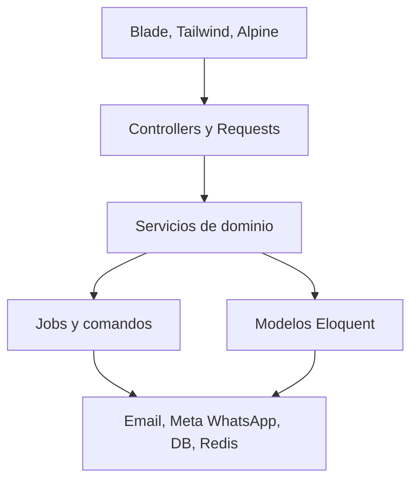
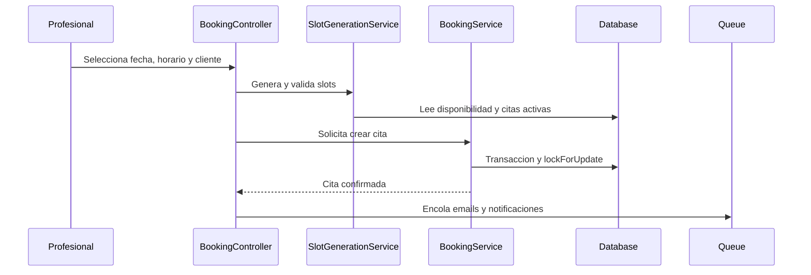
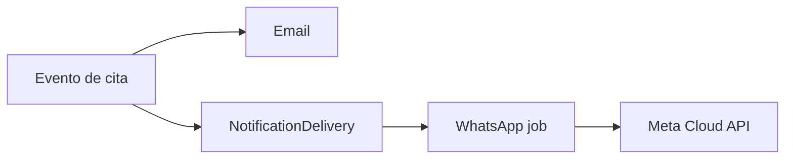

# Arquitectura

Appointments Kit es un monolito Laravel para citas, disponibilidad, pagos manuales y notificaciones.

El codigo central es reusable. La variacion por cliente vive en configuracion, traducciones, assets y datos.

## Capas



## Entidades Principales

### `User`

Representa acceso autenticado.

Roles:

- `admin`;
- `professional`.

Relaciones:

- `hasOne(Professional)`.

### `Professional`

Representa al proveedor que atiende citas.

Responsabilidades:

- perfil publico;
- zona horaria;
- idioma preferido;
- datos de WhatsApp;
- estado activo;
- aprobacion administrativa;
- relacion con servicios, disponibilidad y citas.

Un profesional es publicamente visible solo si:

- esta activo;
- esta aprobado;
- tiene link de reunion;
- pertenece a un usuario con rol `professional`.

### `SessionType`

Representa el servicio tecnico usado por una cita.

Aunque la superficie comercial sea simple, la tabla conserva:

- duracion;
- precio interno;
- moneda;
- compatibilidad con citas historicas y reportes.

### `Availability`

Representa disponibilidad semanal del profesional.

Reglas:

- `day_of_week` usa ISO-8601, de `1` a `7`;
- `start_time` y `end_time` son horas sin fecha;
- la conversion entre hora local y UTC pasa por `TimezoneService`.

### `Appointment`

Representa una cita.

Campos clave:

- `professional_id`;
- `session_type_id`;
- `patient_*`;
- `starts_at` y `ends_at` en UTC;
- `status`;
- `payment_status`;
- `token` publico opaco;
- campos de recordatorio.

Reglas:

- el token permite paginas publicas sin login;
- los solapamientos se previenen con transacciones y locks;
- citas canceladas no bloquean disponibilidad;
- recordatorios se reclaman antes de encolarse.

### `NotificationDelivery`

Representa entregas WhatsApp transaccionales.

La idempotencia usa:

```text
appointment_id + event + channel + recipient_type + event_version
```

No guardes tokens ni payloads completos en metadata.

## Servicios Principales

| Servicio | Responsabilidad |
| --- | --- |
| `BookingService` | Crear citas con transaccion y control de solapamientos. |
| `SlotGenerationService` | Generar horarios disponibles. |
| `AvailableSlotResolver` | Validar un slot seleccionado. |
| `AvailabilityService` | Normalizar disponibilidad semanal. |
| `CancellationPolicyService` | Evaluar cancelacion, reembolso y reprogramacion. |
| `TimezoneService` | Convertir y formatear fechas y horas. |
| `CountryTimezoneService` | Resolver timezone IANA desde pais y region efectiva. |
| `AppointmentReportService` | Calcular reportes administrativos. |

## Flujo De Cita Interna



## Cancelacion Y Reprogramacion

`CancellationPolicyService` lee reglas desde `config/booking.php`.

Mantén estas garantias:

- validar estado de cita;
- verificar ventana de cancelacion;
- verificar ventana de reprogramacion;
- limitar cantidad de reprogramaciones;
- excluir la misma cita al validar solapamiento;
- omitir recordatorios pendientes cuando la cita cambia.

## Notificaciones



Email y WhatsApp son canales separados.

WhatsApp depende de:

- feature flag activo;
- proveedor Meta configurado;
- telefono valido;
- consentimiento del cliente;
- preferencias del profesional;
- plantilla aprobada.

## Seguridad

Conserva estas protecciones:

- policies;
- CSRF;
- rate limits;
- URLs firmadas;
- tokens UUID opacos;
- mass assignment con atributos `#[Fillable]`;
- campos sensibles con `#[Hidden]`;
- auditoria inmutable;
- logs sin secretos;
- validacion de timezone.

## Compatibilidad Legacy

Existen redirects para nombres anteriores:

- `/therapists` hacia `/professionals`;
- `/therapists/{slug}` hacia perfil profesional;
- `/therapist/appointments` hacia agenda profesional.

Tambien existen alias de entrada:

- `therapist_country`;
- `therapist_timezone`.

Estas compatibilidades pueden eliminarse si el cliente no necesita migrar trafico antiguo.
