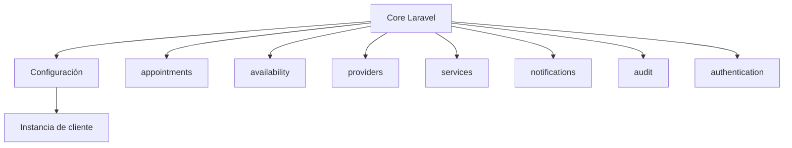
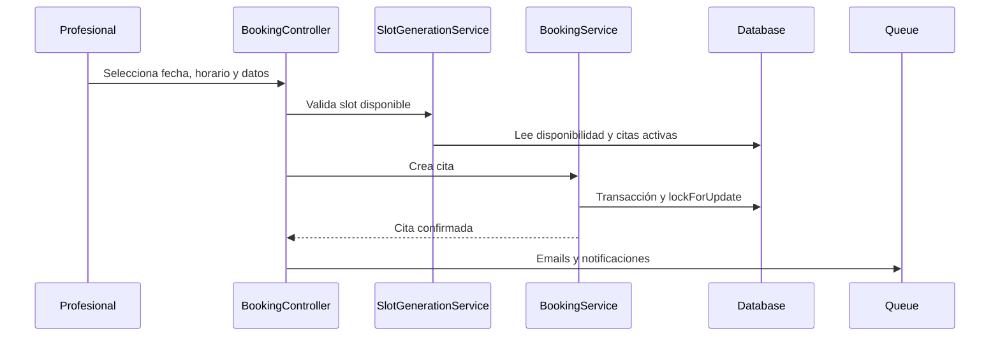
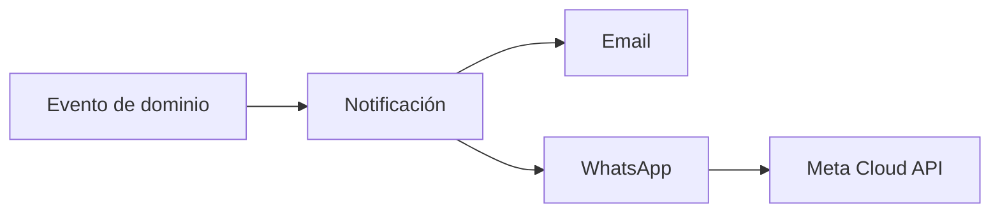

# Arquitectura

Appointments Kit es un monolito Laravel.

El diseño actual separa tres niveles:

## Core

El core contiene lógica reusable:

- autenticación;
- roles;
- citas;
- disponibilidad;
- generación de horarios;
- cancelación;
- reprogramación;
- pagos manuales;
- emails;
- WhatsApp;
- auditoría;
- reportes;
- monitoreo de colas.

## Configuración

La variación por cliente vive en configuración:

- `config/branding.php`: identidad visual y enlaces.
- `config/booking.php`: reglas de citas y recordatorios.
- `config/features.php`: funciones activas.
- `config/terminology.php`: términos visibles.
- `config/services.php`: proveedores externos.

No uses condicionales por cliente.

Usa valores explícitos en `.env`.

## Instancia De Cliente

Cada cliente debe tener:

- `.env` propio;
- base de datos propia;
- branding propio;
- logo y favicon propios;
- servicios;
- profesionales;
- horarios;
- reglas comerciales;
- credenciales externas.

## Modelo De Datos Actual

El código todavía usa nombres heredados:

- `Professional` representa al profesional.
- `SessionType` representa el servicio.
- `Appointment` representa la cita.
- campos `patient_*` representan al cliente.

No renombres estas entidades sin revisar migraciones, factories, relaciones, tests y rutas.

## Booking

## Cancelación Y Reprogramación

Las reglas están en `CancellationPolicyService`.

Ahora leen de `config('booking.policies.*')`.

Mantén:

- transacciones;
- locks;
- validación de solapamiento;
- conteo de reprogramaciones;
- omisión de recordatorios pendientes cuando cambia la cita.

## Notificaciones

WhatsApp depende de:

- `features.whatsapp`;
- `services.meta_whatsapp.enabled`;
- consentimiento del cliente;
- preferencias del profesional.

## Seguridad

Conserva estas protecciones:

- policies;
- mass assignment controlado;
- URLs firmadas;
- tokens públicos opacos;
- CSRF;
- rate limits;
- locks de concurrencia;
- logs operativos sin secretos.
